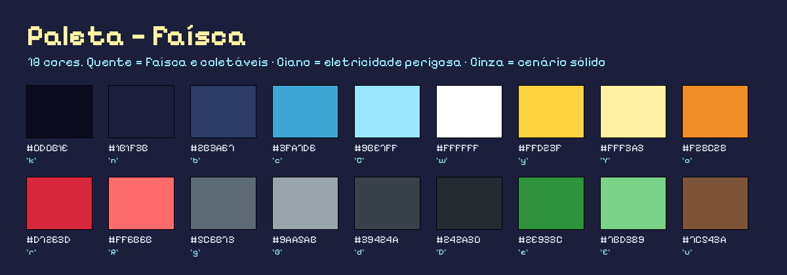

# Direção visual

## Especificações técnicas
| Item | Valor |
|---|---|
| Tamanho do tile | 16 × 16 px |
| Pixels por unidade (PPU) | 16 (sprites) · 32 (UI) |
| Filtro / compressão | Point / sem compressão (configurado por `ArtImportPostprocessor`) |
| Câmera | ortográfica, tamanho 7,5 → 15 tiles de altura (48 px por tile em 720p) |
| Resolução de referência da UI | 1280 × 720, *Scale With Screen Size* |
| Fonte | Pixelify Sans (OFL) — única fonte externa |

## Paleta (18 cores)

Regras de uso:
1. **Quente** (amarelo/laranja) = Faísca, células, botões ativos. É o que o jogador deve seguir.
2. **Ciano** = eletricidade perigosa (arcos) e o Pulso. A Faísca só fica ciano quando está invulnerável a arcos.
3. **Vermelho** = inimigo (LED do Curto) e dano.
4. **Cinza** = tudo que é sólido.
5. **Azul-marinho/roxo** = fundo; nunca usado em objetos interativos.

## Pranchas
| Arquivo | Conteúdo |
|---|---|
| `ConceptArt/Exploracao_Silhuetas.png` | três propostas de protagonista e o motivo da escolha |
| `ConceptArt/Concept_TelaDeJogo.png` | mock-up da tela de jogo com HUD e parallax |
| `ModelSheets/Faisca_ModelSheet.png` | proporções, colisor, todos os quadros de animação |
| `ModelSheets/Curto_ModelSheet.png` | inimigo: conceito, interação e animações |
| `ModelSheets/Objetos_ModelSheet.png` | células, arcos, checkpoint, transformador, tiles e plataforma |

## Pipeline de arte
1. Os sprites são desenhados em `Tools/gen_art.py` (pixel art descrita em código: grades ASCII e formas com paleta fixa).
2. `python3 Tools/gen_art.py` grava os PNGs em `Assets/Art/` — sempre o mesmo resultado (sementes fixas), então o diff do Git mostra só o que mudou.
3. `python3 Tools/gen_docs_art.py` regenera estas pranchas a partir dos mesmos desenhos.
4. Ao entrar na Unity, o `ArtImportPostprocessor` aplica as configurações de importação automaticamente.

> Uma equipe que prefira desenhar no Aseprite/Piskel/LibreSprite segue o mesmo fluxo: basta exportar os PNGs com os mesmos nomes em `Assets/Art/Sprites/...`.

## Animação
- Animações por quadros (Animator + AnimationClips gerados pelo `ProjectBootstrapper`).
- Taxas: Idle 8 fps, Run 14, Jump/Fall 10, Dash 20, Hurt 12; Curto 8; célula 10; arco 14.
- Complementos procedurais no código: *squash & stretch* (pulo, pouso, Pulso, pisão), piscar na invulnerabilidade, flutuação das células, aviso piscante antes do arco ligar.
- Partículas: `FX_SparkBurst` (coleta, Pulso, dano, pisão, checkpoint) e `FX_Dust` (pulo e pouso).
