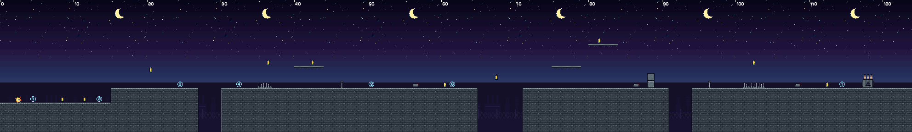
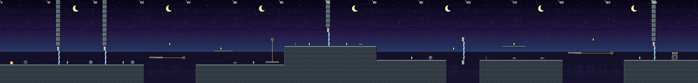
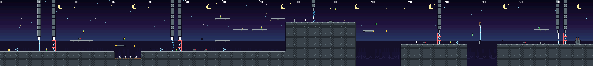

# Level design

## Formato dos mapas
As fases são arquivos de texto em `Assets/Resources/Levels/` (o mesmo arquivo é lido pela Unity e pelas ferramentas). Cada caractere é um tile de 1 × 1 unidade; a linha 0 é o topo.

```
@nome=Pátio de Manobras      ← metadados
@meta=7                      ← células necessárias
@dica1=A/D ou setas: mover   ← texto do gatilho '1'
..........................
..P.1.....C...............
##########################
```

| Símbolo | Significado | Símbolo | Significado |
|---|---|---|---|
| `#` | chão (auto-tile) | `C` | célula de energia |
| `B` | bloco metálico | `E` | Curto (inimigo) |
| `I` | isolador (sólido) | `K` | checkpoint |
| `-` | passarela atravessável por baixo | `P` | início do jogador |
| `^` | sucata (dano) | `G` | transformador (2 × 2, canto inferior esquerdo) |
| `~` | arco elétrico — fase A | `M` … `m` | plataforma móvel horizontal (início … fim) |
| `!` | arco elétrico — fase B | `V` … `v` | plataforma móvel vertical (início … fim) |
| `1`–`9` | gatilho de dica (`@dicaN`) | `.` | vazio |

**Validação e preview:** `python3 Tools/render_levels.py` confere largura das linhas, `P`/`G` únicos, meta ≤ células, pares `M/m` e `V/v`, dicas definidas e se entidades estão apoiadas no chão; depois gera `faseN_mapa.png` com os sprites reais.

## Métricas que guiam o desenho
Valores medidos por simulação da física do `PlayerController` (gravidade ×3,5, queda ×1,7, 50 Hz):

| Métrica | Valor | Regra adotada no mapa |
|---|---|---|
| Altura máxima do pulo | ≈ 3,5 tiles | plataformas no máximo **3** tiles acima |
| Alcance do pulo correndo | ≈ 5,8 tiles | vãos sem Pulso de no máximo **4** tiles |
| Pulo + Pulso no ápice | ≈ 8,3 tiles | vãos com Pulso de **6 a 7** tiles |
| Tela | 26,7 × 15 tiles | cada desafio cabe inteiro na tela antes de ser enfrentado |

## Progressão (ensinar → testar → combinar)

### Fase 1 — Pátio de Manobras (124 × 18, meta 7/10)


| Trecho (x) | Ensina | Como |
|---|---|---|
| 0–14 | mover | dica 1, células no caminho |
| 13–29 | pular, buracos | degrau de 2 tiles, vão de 3 |
| 30–48 | sucata, passarela | sucata baixa com célula acima (recompensa o pulo) |
| 46 | checkpoint | antes do primeiro inimigo |
| 50–64 | pisar no Curto | inimigo sozinho em área plana |
| 61–70 | **Pulso** | vão de 6 tiles impossível sem Pulso, célula no meio do caminho |
| 71–123 | revisão | passarelas em escada, bloco-parede, sucata tripla, inimigo final |

### Fase 2 — Linhas de Transmissão (150 × 18, meta 9/12)


| Trecho (x) | Introduz/Testa |
|---|---|
| 0–30 | **arcos rítmicos**: dois portões (pilar + isolador + arco) — esperar ou atravessar com Pulso |
| 31–41 | **plataforma móvel horizontal** sobre poço |
| 42–60 | Curto + passarela com célula |
| 57–80 | **plataforma vertical** até o platô (4 tiles: alto demais para pular) |
| 81–102 | pulo + Pulso **através** de um arco sobre o vão (o isolador no meio é um apoio arriscado) |
| 103–149 | dois Curtos, segunda plataforma móvel e um último portão antes do transformador |

### Fase 3 — Transformador Principal (160 × 18, meta 11/14)


| Trecho (x) | Combina |
|---|---|
| 0–30 | **arcos alternados** `~` / `!` com zona segura de 3 tiles entre eles; Curto patrulhando passarela |
| 31–37 | fosso de sucata com plataforma móvel |
| 38–56 | portões A/B colados (um Pulso atravessa os dois) e dois Curtos |
| 57–79 | escalada por passarelas em zigue-zague até o platô alto |
| 77–95 | rota alta com arco e sucata |
| 96–133 | descida com plataforma móvel, portão B e vão final com arco + isolador |
| 134–159 | checkpoint, Curto, sucata coberta por passarela e portões A/B finais |

## Decisões e alterações registradas
- **v0.2:** metas fixadas em ~70–80 % das células: dá margem para errar sem tornar a coleta trivial.
- **v0.3:** a simulação mostrou só 0,35 tile de folga para alcançar plataformas a 3 tiles de altura com `jumpVelocity = 15,5`; o valor foi para **16** (folga de ~0,55 tile).
- **v0.5:** checkpoints posicionados logo **antes** de cada mecânica nova, para que o jogador repita apenas o trecho em que errou.
