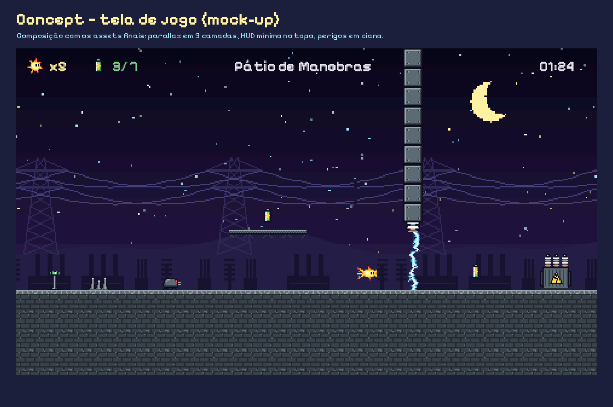

# FAÍSCA



**Faísca** é um jogo de plataforma 2D em *pixel art* feito em **Unity + C#**. Uma pequena centelha atravessa uma subestação às escuras, coleta células de energia e religa o transformador principal para devolver a luz à cidade.

---

## Como abrir o projeto
1. Instale a **Unity 6 LTS** (6000.0 ou mais recente) pelo Unity Hub, com o módulo de build da sua plataforma.
2. Unity Hub ▸ **Add ▸ Add project from disk** ▸ selecione esta pasta.
3. Na **primeira abertura**, a ferramenta `ProjectBootstrapper` roda sozinha e gera prefabs, animações, materiais, configurações e as cenas `MainMenu`, `Game` e `Ending` a partir dos assets versionados (leva alguns segundos).
4. Abra `Assets/Scenes/MainMenu.unity` e aperte **Play**.
5. Faça um commit com os arquivos gerados (`Assets/Scenes`, `Assets/Prefabs`, `Assets/Animations`, `Assets/Resources/*.asset`, `ProjectSettings/` e os `.meta`).

Menu **Faísca** no editor:
| Item | Função |
|---|---|
| Gerar projeto | recria prefabs, animações e cenas (pede confirmação) |
| Gerar build ▸ Windows / Linux / macOS | gera o executável em `Builds/` |
| Abrir cena ▸ Menu / Jogo / Final | atalhos |

## Controles
| Ação | Teclado | Controle |
|---|---|---|
| Mover | A / D ou setas | analógico |
| Pular (segure para ir mais alto) | Espaço, W, seta para cima ou Z | A |
| **Pulso** (dash) | Shift, X, J ou K | X / RB |
| Pausar | Esc ou P | Start |

## Estrutura do repositório
```
Assets/
  Art/            sprites, tiles, fundos, UI e fonte (arte própria + 1 fonte OFL)
  Audio/          músicas, ambiência e efeitos (áudio próprio)
  Resources/      fases em texto (Levels/) + GameConfig e AudioLibrary (gerados)
  Scripts/        C#: Core, Player, Gameplay, Level, CameraFX, UI, Editor
  Scenes/ Prefabs/ Animations/   gerados pelo ProjectBootstrapper
Docs/
  GDD.md          Game Design Document
  Planejamento/   cronograma, escopo (MoSCoW), equipe, checklist de requisitos
  Arte/           direção visual, paleta, concept arts, model sheets
  LevelDesign/    formato dos mapas, métricas, progressão, mapas renderizados
  Audio/          design de áudio
  Testes/         playtests, bugs, checklist da build
  Apresentacao/   roteiro da apresentação final
Tools/            scripts Python que produzem a arte, o áudio e os previews das fases
Packages/         manifesto de pacotes da Unity
```

## Ferramentas da equipe (Python 3 + Pillow + NumPy)
```bash
pip install pillow numpy
python3 Tools/gen_art.py        # sprites, tiles, fundos e UI → Assets/Art
python3 Tools/gen_docs_art.py   # paleta, concept arts e model sheets → Docs/Arte
python3 Tools/gen_audio.py      # músicas, ambiência e efeitos → Assets/Audio
python3 Tools/render_levels.py  # valida as fases e gera os mapas → Docs/LevelDesign
```

## Versões
Cada etapa tem uma tag anotada (`git tag -n`):

| Tag | Etapa | Data prevista |
|---|---|---|
| `v0.1` | Concepção e GDD inicial | 05/10 |
| `v0.2` | Direção visual e level design | 05/10 |
| `v0.3` | Protótipo jogável | 05/10 |
| `v0.4` | Vertical slice | 05/10 |
| `v0.5` | Beta / feature lock | 05/10 |
| `v1.0` | Versão final | 05/10 |

Detalhes em [`CHANGELOG.md`](CHANGELOG.md). Requisitos do enunciado × evidências: [`Docs/Planejamento/ChecklistRequisitos.md`](Docs/Planejamento/ChecklistRequisitos.md).

## Entrega da build
Ver [`Docs/Testes/ChecklistBuild.md`](Docs/Testes/ChecklistBuild.md): gerar pelo menu, testar em outro computador 

## Créditos
Ver [`CREDITS.md`](CREDITS.md).
